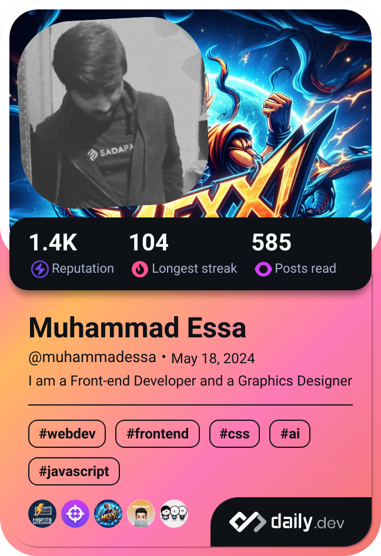

<!--  20 October 2024 3:43 AM  -->

<!--    -->
  
  

    
    
    
    
  

  
<!--   <h1>
    Hey there!
    
  </h1> -->

<!--div>Daily dev card</div-->  

---

### :man_technologist: About Me :
I am a Front-end Web Developer  from Pakistan.

- :telescope: I’m working as a Web Developer and Learning stuff in the process.

- :seedling: Exploring new technologies.

- :zap: I love reading books and articles in my free time.

- :mailbox:How to reach me:  

---

### :hammer_and_wrench: Languages and Tools :

  &nbsp;
  &nbsp;
  &nbsp;
  &nbsp;
  &nbsp;
  &nbsp;
  &nbsp;
  
  

---

### 📊 GitHub Stats:
 
 

### 🏆 GitHub Trophies

### ✍️ Random Dev Quote

### 😂 Developer Jokes

### 🔝 Top Contributed Repo

---

### :writing_hand: Blog Posts :

<!-- BLOG-POST-LIST:START -->
- [Exploring ChatGPT&#39;s New Search Feature: A Powerful Tool for Real-Time Information](https://dev.to/magsimuhammadessa/exploring-chatgpts-new-search-feature-a-powerful-tool-for-real-time-information-d7e)
- [Responsive Typography: Making Text Adapt to All Screens](https://dev.to/magsimuhammadessa/responsive-typography-making-text-adapt-to-all-screens-29p3)
- [The Simple Frontend Web Development Roadmap: A Guide for Beginners](https://dev.to/magsimuhammadessa/the-simple-frontend-web-development-roadmap-a-guide-for-beginners-32i5)
- [The story behind John Doe](https://dev.to/magsimuhammadessa/the-story-behind-john-doe-3pbl)
<!-- BLOG-POST-LIST:END -->

<!-- HTML -->

<!---  This below stuff was 3 years before 20 October 2024 memories man memories
- 👋 Hi, I’m @MuhammadEssaMagsi
- 👀 I’m interested in Computer related stuff
- 🌱 I’m currently learning using github and heroku to make whatsapp bots
- 💞️ I’m looking to collaborate on whatsapp bots
- 📫 +923322147896
--->
<!---
MuhammadEssaMagsi/MuhammadEssaMagsi is a ✨ special ✨ repository because its `README.md` (this file) appears on your GitHub profile.
You can click the Preview link to take a look at your changes.
--->
